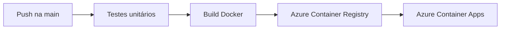

# Manual técnico — Integração CI/CD

## 1. Visão geral

O CadastroFlow é um sistema de cadastro de clientes desenvolvido com HTML, CSS e JavaScript. A entrega em produção acontece automaticamente após cada `push` na branch `main`.



Se um teste falhar, a imagem não é publicada e o site em produção não é atualizado.

## 2. Estrutura e Docker

O workflow está em `.github/workflows/ci-cd.yml`. O `Dockerfile`, na raiz, usa `nginx:alpine` e copia `index.html`, `css/`, `js/` e `nginx.conf` para servir o site na porta interna `80`.

```bash
docker compose up -d --build
```

Localmente, acesse `http://localhost:8080`.

## 3. Testes unitários

O projeto usa `node:test` e executa oito testes com:

```bash
npm test
```

Os testes verificam dados válidos, campos inválidos, e-mail duplicado, edição, normalização, busca, armazenamento e recuperação de armazenamento corrompido.

## 4. Workflow do GitHub Actions

O workflow é disparado por `push` na `main`, pull request para `main` e execução manual. Em pull request, apenas os testes rodam. Em `push` na `main`, os jobs seguem esta ordem obrigatória:

1. `testes` executa `npm test` no Node.js 22;
2. `publicar-imagem` depende de `testes`, monta a imagem e envia as tags `latest` e SHA para o ACR;
3. `deploy` depende da publicação, autentica no Azure e cria uma nova revisão do Container App.

## 5. Azure Container Registry

O registro privado usado é `acrcadastroflowjoao.azurecr.io`. O workflow publica:

```text
acrcadastroflowjoao.azurecr.io/cadastroflow:latest
acrcadastroflowjoao.azurecr.io/cadastroflow:SHA_DO_COMMIT
```

## 6. Secrets necessários

Em **Settings → Secrets and variables → Actions**, foram configurados:

| Secret | Finalidade |
|---|---|
| `AZURE_REGISTRY` | Servidor de logon do ACR |
| `AZURE_REGISTRY_USERNAME` | Login para publicar a imagem |
| `AZURE_REGISTRY_PASSWORD` | Senha para publicar a imagem |
| `AZURE_CREDENTIALS` | JSON de uma identidade de serviço limitada ao grupo de recursos do projeto |

Nenhum desses valores deve ser colocado no código ou em prints públicos.

## 7. Deploy no Azure Container Apps

O deploy usa o grupo `rg-cadastroflow-joao`, o ambiente `env-cadastroflow-joao` e o aplicativo `cadastroflow-app-joao`. Ele recebe tráfego HTTP externo na porta `80` e está disponível em:

<https://cadastroflow-app-joao.wittyglacier-d022ad0f.brazilsouth.azurecontainerapps.io/>

A cada `push` aprovado, a action `azure/container-apps-deploy-action` envia a tag SHA para uma nova revisão. Assim, o Container App atualiza sem deploy manual no portal.

## 8. Conferência final

- `npm test`: 8 testes aprovados;
- GitHub Actions: três jobs verdes;
- ACR: tags `latest` e SHA;
- Azure Container Apps: nova revisão em execução;
- URL pública: sistema de cadastro acessível.

## Referências

- [GitHub Actions — Workflow syntax](https://docs.github.com/actions/using-workflows/workflow-syntax-for-github-actions)
- [GitHub Actions — Secrets](https://docs.github.com/actions/security-guides/using-secrets-in-github-actions)
- [Azure Container Apps — GitHub Actions](https://learn.microsoft.com/azure/container-apps/github-actions)
