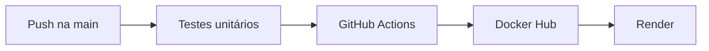

# Manual técnico — Integração CI/CD

## 1. Visão geral

O CadastroFlow é um sistema de cadastro de clientes desenvolvido com HTML, CSS e JavaScript. O foco deste projeto é demonstrar como uma alteração enviada ao GitHub chega automaticamente à produção.



Se um teste falhar, os jobs seguintes são bloqueados e a versão em produção não é alterada.

## 2. Estrutura do projeto

```text
cadastroflow-cicd/
├── .github/workflows/ci-cd.yml
├── css/styles.css
├── docs/MANUAL.md
├── js/app.js
├── js/customerService.js
├── tests/customerService.test.js
├── Dockerfile
├── docker-compose.yml
├── nginx.conf
├── index.html
├── package.json
└── README.md
```

As regras de validação, criação, busca e armazenamento estão separadas em `js/customerService.js`. A manipulação da interface fica em `js/app.js`.

## 3. Docker

A imagem utiliza `nginx:alpine`. O Dockerfile copia a configuração do Nginx e somente os arquivos necessários para servir o site na porta 80.

```dockerfile
FROM nginx:alpine

COPY nginx.conf /etc/nginx/conf.d/default.conf
COPY index.html /usr/share/nginx/html/index.html
COPY css /usr/share/nginx/html/css
COPY js /usr/share/nginx/html/js

EXPOSE 80
HEALTHCHECK --interval=30s --timeout=3s --start-period=5s --retries=3 \
  CMD wget --quiet --tries=1 --spider http://localhost/ || exit 1
```

Execução local:

```bash
docker compose up -d --build
```

Depois, acesse `http://localhost:8080`.

## 4. Testes unitários

O projeto utiliza `node:test`, incluído no Node.js. Não é necessário instalar bibliotecas adicionais.

```bash
npm test
```

São verificados oito casos:

1. cliente com dados válidos;
2. nome, e-mail e telefone inválidos;
3. e-mail duplicado;
4. manutenção do próprio e-mail durante a edição;
5. normalização de nome e e-mail;
6. busca por nome, e-mail ou cidade;
7. gravação e leitura do armazenamento;
8. tratamento de armazenamento corrompido.

## 5. GitHub Actions

O workflow está em `.github/workflows/ci-cd.yml`. Ele é iniciado por:

- `push` na branch `main`;
- `pull_request` direcionado à `main`;
- execução manual por `workflow_dispatch`.

O job `testes` configura o Node.js 22 e executa `npm test`. O job `publicar-imagem` possui `needs: testes`, portanto somente começa depois da aprovação dos testes. O job `deploy` depende da publicação da imagem.

Em pull requests, somente os testes são executados. A publicação e o deploy ficam restritos ao push na `main`.

## 6. Secrets necessários

Cadastre em **Settings → Secrets and variables → Actions**:

| Secret | Conteúdo |
|---|---|
| `DOCKERHUB_USERNAME` | Nome do usuário no Docker Hub |
| `DOCKERHUB_TOKEN` | Personal Access Token do Docker Hub |
| `RENDER_DEPLOY_HOOK_URL` | URL do Deploy Hook criado no Render |

As credenciais nunca devem ser colocadas diretamente no código, README ou workflow.

## 7. Docker Hub

Crie no Docker Hub um repositório chamado `cadastro-clientes`. O workflow publica duas tags:

```text
SEU_USUARIO/cadastro-clientes:latest
SEU_USUARIO/cadastro-clientes:SHA_DO_COMMIT
```

`latest` é usada pelo serviço de produção. A tag com SHA permite identificar exatamente qual commit gerou a imagem.

## 8. Render

1. No Render, crie um **Web Service**.
2. Escolha **Existing Image**.
3. Informe `docker.io/SEU_USUARIO/cadastro-clientes:latest`.
4. Configure `/health` como Health Check Path.
5. Em **Settings**, crie ou copie o Deploy Hook.
6. Salve a URL no secret `RENDER_DEPLOY_HOOK_URL` do GitHub.

Quando o job final chama o Deploy Hook, o Render baixa a nova imagem `latest` e inicia a substituição do container.

## 9. Fluxo completo

1. O desenvolvedor executa `git push origin main`.
2. O GitHub Actions inicia os testes.
3. Se os testes passarem, uma imagem Docker é construída.
4. A imagem é enviada ao Docker Hub com duas tags.
5. O Deploy Hook do Render é acionado.
6. O Render baixa e executa a nova imagem.

## 10. Dificuldades e soluções

| Dificuldade | Solução |
|---|---|
| Código ligado diretamente à tela | Separação das regras em `customerService.js` |
| Deploy mesmo com erro | Dependência entre jobs usando `needs` |
| Risco de expor credenciais | GitHub Actions Secrets |
| Imagem com arquivos desnecessários | Uso de `.dockerignore` |
| Render não atualiza imagem externa sozinho | Deploy Hook após a publicação |
| Erro “no configuration file provided” | Executar Docker Compose na raiz do projeto |

## 11. Conferência final

- `npm test` deve apresentar 8 testes aprovados e 0 falhas;
- `docker compose up -d --build` deve abrir o site em `localhost:8080`;
- a aba Actions deve mostrar os três jobs em verde após um push na `main`;
- o Docker Hub deve mostrar as tags `latest` e SHA;
- o painel do Render deve registrar um novo deploy.

## Referências

- [GitHub Actions — Workflow syntax](https://docs.github.com/actions/using-workflows/workflow-syntax-for-github-actions)
- [GitHub Actions — Secrets](https://docs.github.com/actions/security-guides/using-secrets-in-github-actions)
- [Docker — GitHub Actions](https://docs.docker.com/build/ci/github-actions/)
- [Render — Deploy Hooks](https://render.com/docs/deploy-hooks)
